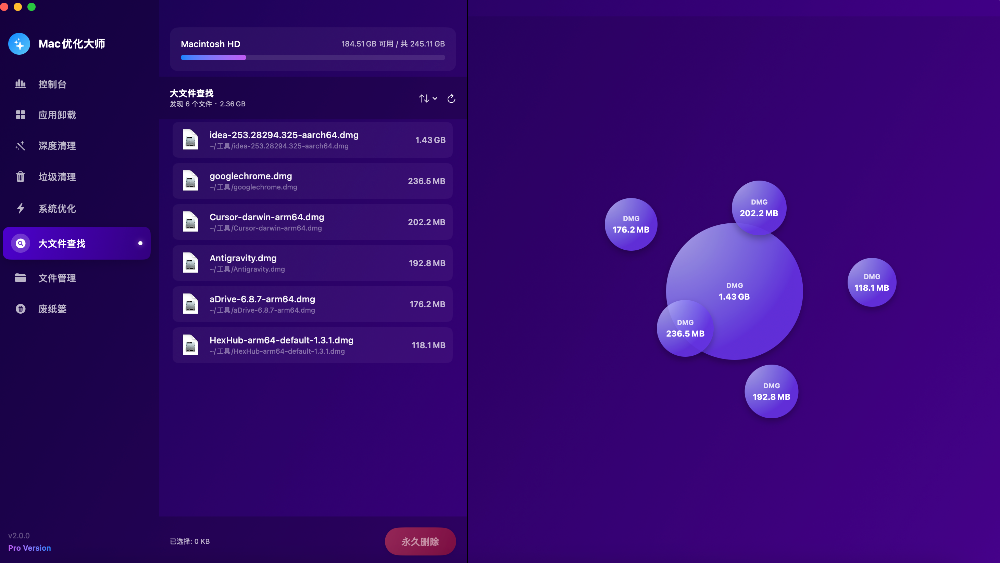
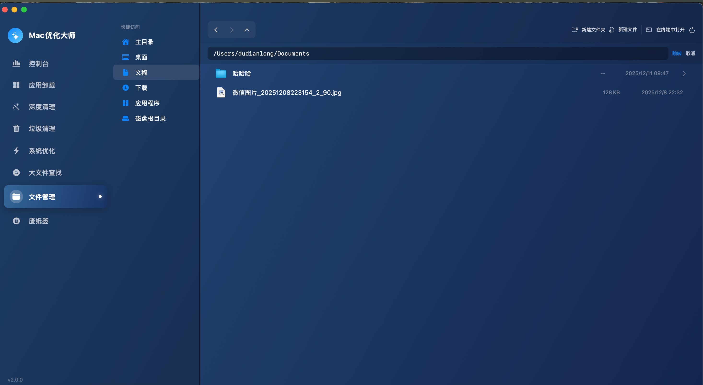
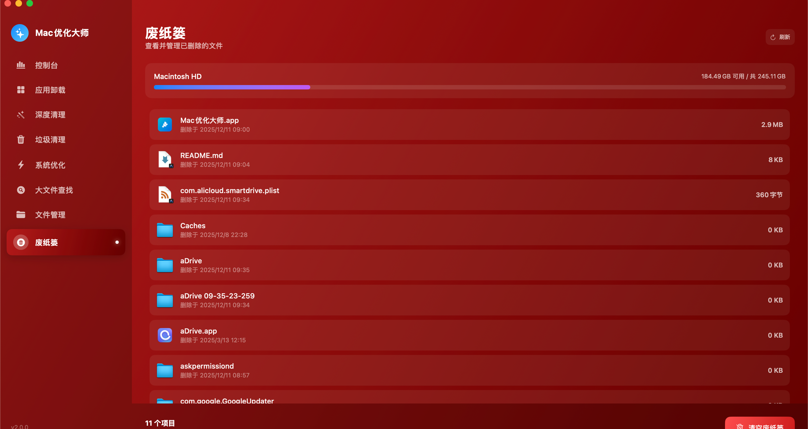

<p align="center">
  
</p>

<h1 align="center">Mac优化大师 (MacOptimizer)</h1>

<p align="center">
  <strong>🚀 一款功能强大的 macOS 系统优化与应用管理工具</strong>
</p>

<p align="center">
  
  
  
  
  
</p>

---

## ✨ 功能特性

Mac优化大师是一款专为 macOS 设计的系统优化工具,采用现代化的 SwiftUI 界面,提供八大核心功能模块:

### 🖥️ 控制台 (系统监控)
- **CPU 占用率** - 实时监控 CPU 使用情况
- **内存状态** - 显示已用/可用内存
- **磁盘空间** - 可视化磁盘使用占比
- **进程管理** - 查看并管理运行中的应用和后台进程
- **一键停止进程** - 快速终止不需要的进程

### 📦 应用卸载
- **智能扫描** - 自动检测已安装的应用程序
- **残留文件检测** - 发现应用关联的所有残留文件
  - 偏好设置 (Preferences)
  - 应用支持 (Application Support)
  - 缓存文件 (Caches)
  - 日志文件 (Logs)
  - 保存状态 (Saved State)
  - 容器 (Containers)
  - 启动代理 (Launch Agents)
  - 崩溃报告 (Crash Reports)
- **完全卸载** - 一键删除应用及所有相关文件
- **选择性删除** - 可选择仅删除残留文件或连同应用一起删除
- **移至废纸篓** - 支持安全删除,可从废纸篓恢复

### 🧹 垃圾清理
- **系统缓存** - 清理 macOS 系统缓存
- **应用缓存** - 清理各应用产生的缓存文件
- **浏览器缓存** - 支持 Safari、Chrome、Firefox 等主流浏览器
- **日志文件** - 清理系统和应用日志
- **分类展示** - 按类型分组显示,支持选择性清理

### ⚡ 系统优化
- **启动项管理** - 查看和禁用开机启动项
- **内存释放** - 一键清理系统内存
- **系统加速** - 优化系统性能

### 🔍 大文件查找
- **智能扫描** - 快速定位占用大量空间的文件
- **多目录扫描** - 扫描主目录下的所有文件
- **可视化展示** - 清晰展示文件大小和位置
- **快速清理** - 支持直接删除或移至废纸篓

### 🗑️ 废纸篓管理
- **查看内容** - 浏览废纸篓中的所有文件
- **空间统计** - 显示废纸篓占用空间
- **一键清空** - 快速清空废纸篓释放空间

### ✨ 深度清理 (新功能)
- **孤立文件扫描** - 扫描已卸载应用的残留文件
- **智能识别** - 自动识别不属于任何已安装应用的文件
- **系统保护** - 自动排除 Apple 系统文件,防止误删
- **分类展示** - 按类型分组:应用支持、缓存、偏好设置、容器、日志等
- **选择性清理** - 支持全选/反选,自由选择要清理的项目
- **安全删除** - 文件移至废纸篓,可恢复

### 📁 文件管理 (新功能)
- **磁盘浏览** - 浏览整个 Mac 磁盘目录结构
- **快捷访问** - 主目录、桌面、文稿、下载、应用程序、磁盘根目录
- **导航功能** - 前进/后退/上级目录 + 面包屑路径栏
- **路径输入** - 支持手动输入路径快速跳转 (支持 `~` 主目录)
- **文件操作** - 新建文件夹、新建文件、重命名、删除
- **显示隐藏文件** - 可切换显示/隐藏系统隐藏文件
- **终端集成** - 一键在系统终端中打开当前目录
- **右键菜单** - 打开、在 Finder 中显示、重命名、删除

---

## 📸 界面预览

 部分功能截图
 

 





## 🛠️ 安装与构建

### 系统要求
- **macOS 13.0 (Ventura)** 或更高版本
- **Apple Silicon (M1/M2/M3)** 或 Intel 芯片 (需修改编译参数)
- **Command Line Tools** (无需安装完整 Xcode)

### 从源码编译

```bash
# 1. 克隆仓库
git clone https://github.com/ddlmanus/MacOptimizer.git
cd MacOptimizer

# 2. 运行构建脚本
chmod +x build.sh
./build.sh

# 3. 启动应用
open build/Mac优化大师.app
```

### 构建脚本说明

`build.sh` 脚本会自动完成以下步骤:
1. ✅ 检查所有源文件是否存在
2. ✅ 创建构建目录和 .app 包结构
3. ✅ 复制 Info.plist 和图标文件
4. ✅ 使用 `swiftc` 编译 Swift 源代码
5. ✅ 使用 Ad-hoc 签名进行代码签名

### Intel 芯片支持

如需在 Intel Mac 上编译,请修改 `build.sh` 中的编译参数:

```bash
# 将
-target arm64-apple-macos13.0
# 改为
-target x86_64-apple-macos13.0
```

---

## 📁 项目结构

```
MacOptimizer/
├── AppUninstaller/              # 源代码目录
│   ├── AppUninstallerApp.swift  # 应用入口
│   ├── ContentView.swift        # 主视图
│   ├── NavigationSidebar.swift  # 侧边栏导航
│   ├── Models.swift             # 数据模型
│   ├── Styles.swift             # 全局样式与主题
│   │
│   ├── # 功能模块
│   ├── MonitorView.swift        # 控制台视图
│   ├── SystemMonitorService.swift # 系统监控服务
│   ├── ProcessService.swift     # 进程管理服务
│   │
│   ├── AppScanner.swift         # 应用扫描器
│   ├── AppDetailView.swift      # 应用详情视图
│   ├── ResidualFileScanner.swift # 残留文件扫描器
│   ├── FileRemover.swift        # 文件删除器
│   │
│   ├── JunkCleaner.swift        # 垃圾清理逻辑
│   ├── JunkCleanerView.swift    # 垃圾清理视图
│   │
│   ├── SystemOptimizer.swift    # 系统优化逻辑
│   ├── OptimizerView.swift      # 系统优化视图
│   │
│   ├── LargeFileScanner.swift   # 大文件扫描器
│   ├── LargeFileView.swift      # 大文件视图
│   │
│   ├── TrashView.swift          # 废纸篓视图
│   ├── DiskSpaceManager.swift   # 磁盘空间管理
│   ├── DiskUsageView.swift      # 磁盘使用视图
│   │
│   ├── DeepCleanScanner.swift   # 深度清理扫描器
│   ├── DeepCleanView.swift      # 深度清理视图
│   │
│   ├── FileExplorerService.swift # 文件管理器服务
│   ├── FileExplorerView.swift   # 文件管理器视图
│   │
│   ├── Info.plist               # 应用配置
│   └── AppIcon.icns             # 应用图标
│
├── build.sh                     # 构建脚本
├── release_package.sh           # 发布打包脚本 (生成 Universal Binary 和 DMG)
├── generate_icon.swift          # 图标生成脚本
└── README.md                    # 项目说明
```

---

## 🔧 技术栈

- **语言**: Swift 5.9
- **UI 框架**: SwiftUI 4.0
- **最低支持**: macOS 13.0 (Ventura)
- **架构模式**: MVVM
- **构建工具**: Swift Compiler (swiftc)

---

## 🚀 开发计划

- [ ] 国际化支持 (English/中文)
- [ ] 定时清理任务
- [ ] 系统状态菜单栏小组件
- [ ] 应用更新检测
- [ ] 重复文件查找
- [ ] 隐私保护 (浏览历史清理)

---

## 🤝 贡献指南

欢迎提交 Pull Request 或创建 Issue!

1. Fork 本仓库
2. 创建功能分支 (`git checkout -b feature/AmazingFeature`)
3. 提交更改 (`git commit -m 'Add some AmazingFeature'`)
4. 推送到分支 (`git push origin feature/AmazingFeature`)
5. 创建 Pull Request

---

## 📄 许可证

本项目采用 [MIT 许可证](LICENSE) 开源。

---

## ⚠️ 免责声明

- 请在使用前备份重要数据
- 删除系统文件可能导致应用无法正常工作
- 建议先使用"移至废纸篓"功能,确认无误后再清空
- 本工具仅供学习和个人使用

---

## 🙏 致谢

- 界面设计灵感来自 [CleanMyMac X](https://cleanmymac.com/)
- 感谢所有贡献者的支持

---

<p align="center">
  Made with ❤️ for macOS
</p>
