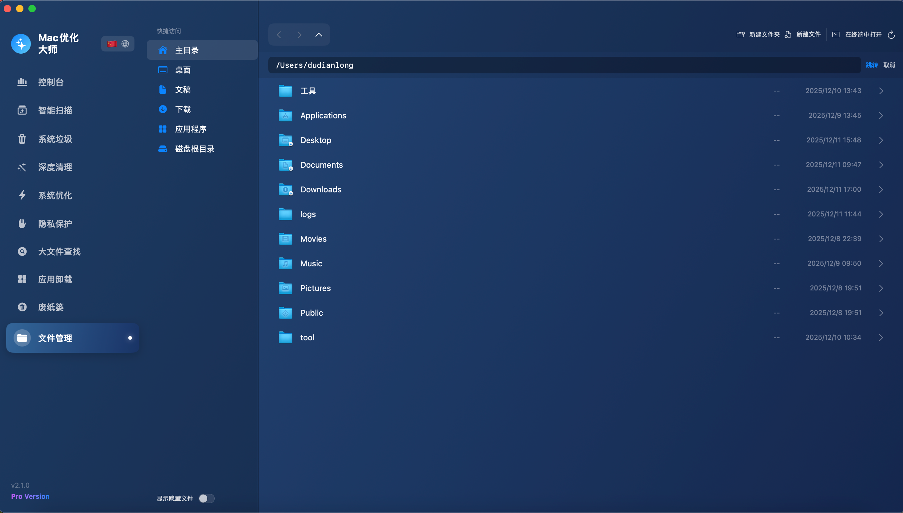
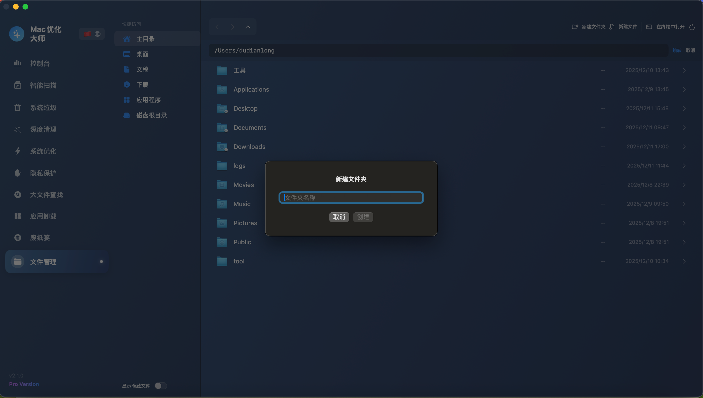

<p align="center">
  
</p>

<h1 align="center">MacOptimizer</h1>

<p align="center">
  <strong>🚀 A Powerful macOS System Optimization and App Management Tool</strong>
</p>

<p align="center">
  
  
  
  
  
  
</p>

---

## ✨ Features

MacOptimizer is a system optimization tool designed specifically for macOS, featuring a modern SwiftUI interface with eight core functional modules:

### 🌐 Multi-Language Support (New!)
- **Chinese & English** - Switch between languages with one click
- **Persistent Settings** - Language preference is saved automatically
- **Full Coverage** - All UI elements support localization

### 🖥️ Console (System Monitor)
- **CPU Usage** - Real-time CPU usage monitoring
- **Memory Status** - Display used/available memory
- **Disk Space** - Visual disk usage percentage
- **Process Management** - View and manage running apps and background processes
- **One-Click Stop** - Quickly terminate unwanted processes

### 📦 App Uninstaller
- **Smart Scanning** - Automatically detect installed applications
- **Residual File Detection** - Find all associated residual files:
  - Preferences
  - Application Support
  - Caches
  - Logs
  - Saved State
  - Containers
  - Launch Agents
  - Crash Reports
- **Complete Uninstall** - Remove app and all related files with one click
- **Selective Deletion** - Choose to delete only residuals or include the app
- **Move to Trash** - Safe deletion with recovery option

### 🧹 Junk Cleaner
- **System Cache** - Clean macOS system cache
- **App Cache** - Clean cache files from various applications
- **Browser Cache** - Support Safari, Chrome, Firefox, and more
- **Log Files** - Clean system and app logs
- **Categorized Display** - Group by type, support selective cleaning

### ⚡ System Optimizer
- **Startup Items** - View and disable startup items
- **Memory Release** - One-click system memory cleanup
- **System Acceleration** - Optimize system performance

### 🔍 Large File Finder
- **Smart Scanning** - Quickly locate space-consuming files
- **Multi-Directory Scan** - Scan all files in home directory
- **Visual Display** - Clear file size and location display
- **Quick Cleanup** - Direct delete or move to trash

### 🗑️ Trash Manager
- **View Contents** - Browse all files in trash
- **Space Statistics** - Show trash space usage
- **One-Click Empty** - Quickly empty trash to free space

### ✨ Deep Clean
- **Orphaned File Scan** - Scan residual files from uninstalled apps
- **Smart Recognition** - Auto-identify files not belonging to installed apps
- **System Protection** - Auto-exclude Apple system files to prevent accidental deletion
- **Categorized Display** - Group by type: App Support, Cache, Preferences, Containers, Logs
- **Selective Cleanup** - Support select all/none, freely choose items to clean
- **Safe Deletion** - Files move to trash for recovery

### 📁 File Explorer
- **Disk Browsing** - Browse entire Mac disk directory structure
- **Quick Access** - Home, Desktop, Documents, Downloads, Applications, Disk Root
- **Navigation** - Forward/Back/Parent + Breadcrumb path bar
- **Path Input** - Manual path input for quick navigation (supports `~`)
- **File Operations** - New folder, new file, rename, delete
- **Hidden Files** - Toggle show/hide system hidden files
- **Terminal Integration** - One-click open current directory in Terminal
- **Context Menu** - Open, Show in Finder, Rename, Delete

---

## 📸 Screenshots




---

## 🛠️ Installation & Build

### System Requirements
- **macOS 13.0 (Ventura)** or later
- **Apple Silicon (M1/M2/M3)** or Intel (modify build parameters)
- **Command Line Tools** (Full Xcode not required)

```

### Download DMG

Download the latest release from [GitHub Releases](https://github.com/ddlmanus/MacOptimizer/releases):
- **Apple Silicon (M1/M2/M3)**: `MacOptimizer_vX.X.X_AppleSilicon.dmg`
- **Intel**: `MacOptimizer_vX.X.X_Intel.dmg`

### Build from Source

```bash
# 1. Clone repository
git clone https://github.com/ddlmanus/MacOptimizer.git
cd MacOptimizer

# 2. Run build script
chmod +x build.sh
./build.sh

# 3. Launch app
open build/Mac优化大师.app
```

### Intel Support

For Intel Mac, modify `build.sh`:

```bash
# Change
-target arm64-apple-macos13.0
# To
-target x86_64-apple-macos13.0
```

---

## 📁 Project Structure

```
MacOptimizer/
├── AppUninstaller/              # Source code
│   ├── AppUninstallerApp.swift  # App entry
│   ├── ContentView.swift        # Main view
│   ├── NavigationSidebar.swift  # Sidebar navigation
│   ├── LocalizationManager.swift # i18n manager (New!)
│   ├── Models.swift             # Data models
│   ├── Styles.swift             # Global styles
│   │
│   ├── MonitorView.swift        # Console view
│   ├── SystemMonitorService.swift
│   ├── ProcessService.swift
│   │
│   ├── AppScanner.swift         # App scanner
│   ├── AppDetailView.swift      # App detail view
│   ├── ResidualFileScanner.swift
│   ├── FileRemover.swift
│   │
│   ├── JunkCleaner.swift        # Junk cleaner
│   ├── JunkCleanerView.swift
│   │
│   ├── SystemOptimizer.swift    # System optimizer
│   ├── OptimizerView.swift
│   │
│   ├── LargeFileScanner.swift   # Large file scanner
│   ├── LargeFileView.swift
│   │
│   ├── TrashView.swift          # Trash view
│   ├── DiskSpaceManager.swift
│   ├── DiskUsageView.swift
│   │
│   ├── DeepCleanScanner.swift   # Deep clean
│   ├── DeepCleanView.swift
│   │
│   ├── FileExplorerService.swift # File explorer
│   ├── FileExplorerView.swift
│   │
│   ├── Info.plist
│   └── AppIcon.icns
│
├── build.sh                     # Build script
├── release_package.sh           # Release packaging
└── README.md
```

---

## 🔧 Tech Stack

- **Language**: Swift 5.9
- **UI Framework**: SwiftUI 4.0
- **Minimum Support**: macOS 13.0 (Ventura)
- **Architecture**: MVVM
- **Build Tool**: Swift Compiler (swiftc)

---

## 🚀 Roadmap

- [x] Multi-language support (English/中文)
- [ ] Scheduled cleanup tasks
- [ ] Menu bar widget
- [ ] App update detection
- [ ] Duplicate file finder
- [ ] Privacy protection (browsing history cleanup)

---

## 🤝 Contributing

Contributions are welcome! Submit a Pull Request or create an Issue.

1. Fork this repository
2. Create feature branch (`git checkout -b feature/AmazingFeature`)
3. Commit changes (`git commit -m 'Add AmazingFeature'`)
4. Push to branch (`git push origin feature/AmazingFeature`)
5. Create Pull Request

---

## 📄 License

This project is open source under the [MIT License](LICENSE).

---

## ⚠️ Disclaimer

- Back up important data before use
- Deleting system files may cause apps to malfunction
- Recommend using "Move to Trash" first, then empty after confirming
- This tool is for learning and personal use only

---

<p align="center">
  Made with ❤️ for macOS
</p>

---

# 中文说明

## ✨ 功能特性

Mac优化大师是一款专为 macOS 设计的系统优化工具，采用现代化的 SwiftUI 界面，提供八大核心功能模块：

### 🌐 多语言支持（新功能！）
- **中英双语** - 一键切换界面语言
- **设置持久化** - 语言偏好自动保存
- **全覆盖** - 所有界面元素均支持本地化

### 🖥️ 控制台（系统监控）
- **CPU 占用率** - 实时监控 CPU 使用情况
- **内存状态** - 显示已用/可用内存
- **磁盘空间** - 可视化磁盘使用占比
- **进程管理** - 查看并管理运行中的应用和后台进程
- **一键停止进程** - 快速终止不需要的进程

### 📦 应用卸载
- **智能扫描** - 自动检测已安装的应用程序
- **残留文件检测** - 发现应用关联的所有残留文件
  - 偏好设置 (Preferences)
  - 应用支持 (Application Support)
  - 缓存文件 (Caches)
  - 日志文件 (Logs)
  - 保存状态 (Saved State)
  - 容器 (Containers)
  - 启动代理 (Launch Agents)
  - 崩溃报告 (Crash Reports)
- **完全卸载** - 一键删除应用及所有相关文件
- **选择性删除** - 可选择仅删除残留文件或连同应用一起删除
- **移至废纸篓** - 支持安全删除，可从废纸篓恢复

### 🧹 垃圾清理
- **系统缓存** - 清理 macOS 系统缓存
- **应用缓存** - 清理各应用产生的缓存文件
- **浏览器缓存** - 支持 Safari、Chrome、Firefox 等主流浏览器
- **日志文件** - 清理系统和应用日志
- **分类展示** - 按类型分组显示，支持选择性清理

### ⚡ 系统优化
- **启动项管理** - 查看和禁用开机启动项
- **内存释放** - 一键清理系统内存
- **系统加速** - 优化系统性能

### 🔍 大文件查找
- **智能扫描** - 快速定位占用大量空间的文件
- **多目录扫描** - 扫描主目录下的所有文件
- **可视化展示** - 清晰展示文件大小和位置
- **快速清理** - 支持直接删除或移至废纸篓

### 🗑️ 废纸篓管理
- **查看内容** - 浏览废纸篓中的所有文件
- **空间统计** - 显示废纸篓占用空间
- **一键清空** - 快速清空废纸篓释放空间

### ✨ 深度清理
- **孤立文件扫描** - 扫描已卸载应用的残留文件
- **智能识别** - 自动识别不属于任何已安装应用的文件
- **系统保护** - 自动排除 Apple 系统文件，防止误删
- **分类展示** - 按类型分组：应用支持、缓存、偏好设置、容器、日志等
- **选择性清理** - 支持全选/反选，自由选择要清理的项目
- **安全删除** - 文件移至废纸篓，可恢复

### 📁 文件管理
- **磁盘浏览** - 浏览整个 Mac 磁盘目录结构
- **快捷访问** - 主目录、桌面、文稿、下载、应用程序、磁盘根目录
- **导航功能** - 前进/后退/上级目录 + 面包屑路径栏
- **路径输入** - 支持手动输入路径快速跳转（支持 `~` 主目录）
- **文件操作** - 新建文件夹、新建文件、重命名、删除
- **显示隐藏文件** - 可切换显示/隐藏系统隐藏文件
- **终端集成** - 一键在系统终端中打开当前目录
- **右键菜单** - 打开、在 Finder 中显示、重命名、删除

---

## 🛠️ 安装与构建

### 系统要求
- **macOS 13.0 (Ventura)** 或更高版本
- **Apple Silicon (M1/M2/M3)** 或 Intel 芯片（需修改编译参数）
- **Command Line Tools**（无需安装完整 Xcode）

### 通过 Homebrew 安装（推荐）

```bash
# 使用 Homebrew Cask 安装
brew tap ddlmanus/macoptimizer
brew install --cask macoptimizer
```

或者从本地 cask 文件安装：

```bash
brew install --cask ./homebrew/macoptimizer.rb
```

### 下载 DMG

从 [GitHub Releases](https://github.com/ddlmanus/MacOptimizer/releases) 下载最新版本：
- **Apple Silicon (M1/M2/M3)**: `MacOptimizer_vX.X.X_AppleSilicon.dmg`
- **Intel**: `MacOptimizer_vX.X.X_Intel.dmg`

### 从源码编译

```bash
# 1. 克隆仓库
git clone https://github.com/ddlmanus/MacOptimizer.git
cd MacOptimizer

# 2. 运行构建脚本
chmod +x build.sh
./build.sh

# 3. 启动应用
open build/Mac优化大师.app
```

### Intel 芯片支持

如需在 Intel Mac 上编译，请修改 `build.sh` 中的编译参数：

```bash
# 将
-target arm64-apple-macos13.0
# 改为
-target x86_64-apple-macos13.0
```
如果觉得对你有帮助，可以点个 star 哦  开发不易，你的支持就是我最大的动力


---

问题收集和建议
https://docs.qq.com/sheet/DY0xIdGZxckVvQUFk?no_promotion=1&is_blank_or_template=blank&tab=s3z6cr

## ⚠️ 免责声明

- 请在使用前备份重要数据
- 删除系统文件可能导致应用无法正常工作
- 建议先使用"移至废纸篓"功能，确认无误后再清空
- 本工具仅供学习和个人使用

---

<p align="center">
  Made with ❤️ for macOS
</p>
